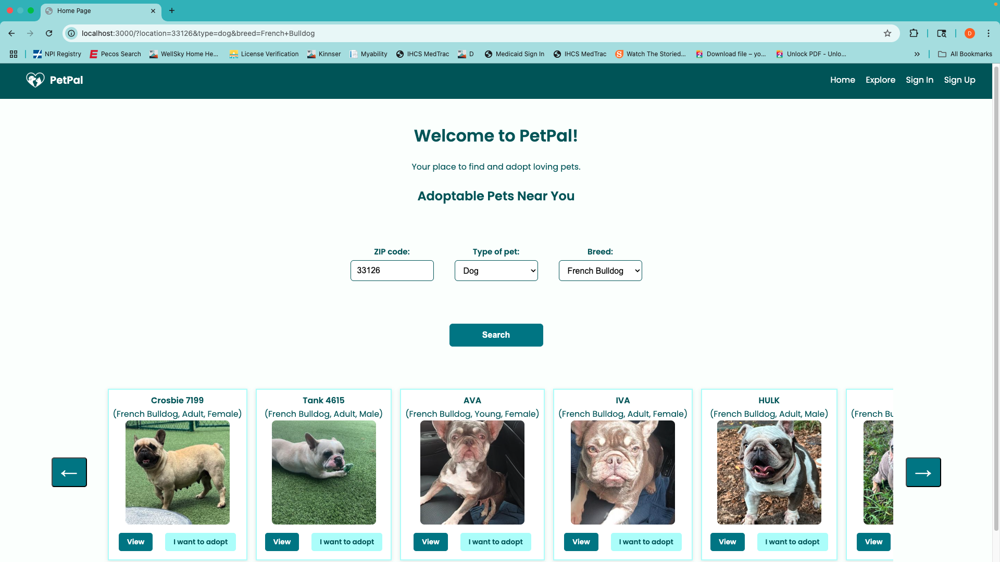

<h1 align="center">PetPal – Pet Adoption App</h1>

  

---

## 📖 About the App

**PetPal** is a full-stack web application that connects people looking to adopt pets with those listing them for adoption. Visitors can browse adoptable pets (both from user listings and the Petfinder API), search by breed and type, and view pet details.

Authenticated users can add, edit, and delete their own pets, apply for adoptions, and save favorites. PetPal includes full CRUD functionality, authentication and authorization, external API integration, and a mobile-responsive interface.

This app was built to create a friendly platform that makes it easy for both pet seekers and pet listers to interact in one place. The concept came from wanting to combine live animal adoption data with a user-powered listing experience.

---

## Getting Started

Try PetPal live here:  
 [PetPal App](https://your-live-deployment-link.com) <!-- Replace this -->

Planning tools used:  
[Trello Board](https://trello.com/b/8XabeOEe/pet-pal)  
[Project Planning](https://github.com/Diana961216/PetPal-Planning/tree/main)

---

## Technologies Used

- HTML5, CSS3, Flexbox & Grid
- JavaScript (ES6)
- Node.js & Express
- MongoDB & Mongoose
- EJS (Embedded JavaScript Templates)
- Petfinder API
- express-session, bcrypt, method-override
- Flash messages
- Mobile responsiveness with media queries

---

## Attributions

- [Petfinder API](https://www.petfinder.com/developers/)
- [Google Fonts: Poppins](https://fonts.google.com/specimen/Poppins)

---

## Next Steps

- Allow users to **message pet owners directly** to ask questions before applying
- Add detailed **breed facts and care requirements** for better-informed adopters
- Build an **admin dashboard** to review and approve pet listings before they're public
